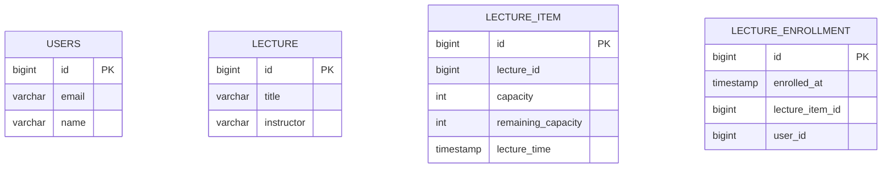

# ERD

---

# 구조 설명

---

### 1. USERS
**USERS** 는 시스템의 사용자 정보를 저장합니다.

- **id**: 각 사용자를 식별하는 고유 식별자입니다.
- **email**: 사용자의 이메일 주소입니다.
- **name**: 사용자의 이름입니다.

### 2. LECTURE
**LECTURE** 는 강의의 정보를 저장합니다.

- **id**: 각 강의를 식별하는 고유 식별자입니다.
- **title**: 강의의 제목입니다.
- **instructor**: 강의를 진행하는 강사의 이름입니다.

### 3. LECTURE_ITEM
**LECTURE_ITEM** 은 특정 강의의 세부 시간대 정보를 관리합니다. 하나의 강의는 여러 시간대로 분리될 수 있습니다.

- **id**: 각 강의 항목을 식별하는 고유 식별자입니다.
- **lecture_id**: 해당 강의 항목이 속한 강의의 ID입니다.
- **capacity**: 해당 강의 항목의 최대 수강 인원입니다.
- **remaining_capacity**: 해당 강의 항목에 남아있는 수강 가능 인원입니다.
- **lecture_time**: 해당 강의 항목의 진행 시간입니다.

### 4. LECTURE_ENROLLMENT
**LECTURE_ENROLLMENT** 는 사용자의 강의 항목 신청 정보를 저장합니다.

- **id**: 각 등록 정보를 식별하는 고유 식별자입니다.
- **lecture_item_id**: 사용자가 등록한 특정 강의 항목의 ID 입니다.
- **user_id**: 강의 항목에 등록한 사용자의 ID 입니다.
- **enrolled_at**: 사용자가 해당 강의 항목에 신청한 시간입니다.

# 설계 설명

---

1. **다대다 관계 처리**
    - **강의 항목(LectureItem)** 과 **사용자(Users)** 간의 관계는 **다대다 관계**입니다.  
      <u>즉, 하나의 강의 항목은 여러 명의 사용자를 가질 수 있고, 한 명의 사용자는 여러 개의 강의 항목에 등록할 수 있습니다.</u>
    - 이를 관리하기 위해 **LectureEnrollment**라는 **관계 테이블**을 생성했습니다.  
      이 테이블은 각 사용자가 어떤 강의 항목에 수강 신청을 했는지를 기록하여 **다대다 관계를 명확히** 관리합니다.

2. **강의 시간 및 수강 인원 관리**
    - 하나의 강의는 여러 강의 항목을 가질 수 있으며, 각 항목의 **강의 시간**과 **수강 인원**은 다르게 설정할 수 있습니다.  
      기본적으로 **LectureItem** 테이블에서 개별 항목의 **최대 수강 인원**과 **남은 수강 인원**을 관리합니다.
    - **LectureItem** 테이블을 통해 개별 강의의 세부 항목을 관리하면서도, **Lecture** 테이블을 통해 공통된 강의 정보를 관리할 수 있어 유연성을 확보했습니다.  
      예를 들어, 강의 자체의 정보를 한 번에 수정하거나 업데이트할 수 있으며, 이때 강의의 세부 시간이나 인원 정보에는 영향을 주지 않습니다.

3. **유니크 키 설정**
    - 동일 사용자가 동일 강의 항목에 중복 등록하지 않도록 **LectureEnrollment** 테이블에 유니크 키를 설정했습니다.  
      이를 통해 한 사용자가 동일한 강의 항목에 여러 번 수강 신청하는 상황을 방지할 수 있습니다.

4. **테이블 분리를 통한 락 적용 범위 감소**
    - **LectureItem** 테이블에만 **비관적 락(Pessimistic Lock)** 을 적용하여 **수강 신청 시 필요한 부분에만 락**을 걸 수 있도록 설계했습니다.  
      이를 통해 특정 강의 항목의 수강 인원이 변경되는 상황에서만 락이 걸리며, **Lecture** 테이블의 기본 강의 정보에는 영향을 주지 않습니다.
    - 이렇게 락 적용 범위를 줄임으로써 시스템 성능을 최적화하고, **락으로 인한 병목 현상을 최소화**할 수 있습니다.

5. **확장성과 유지보수 용이성**
    - 설계된 구조는 확장성이 높아, 새로운 강의 항목이나 시간이 추가되더라도 시스템에 큰 변경 없이 수용할 수 있습니다.
    - 또한, 각 테이블의 독립성을 유지하여, **강의 변경**이나 **사용자 관리** 시 **서로 다른 테이블에 대한 불필요한 락이 걸리는 문제를 방지**할 수 있습니다.

---

### 결론

이 설계는 다음과 같은 장점을 얻을 수 있습니다.

- **확장성**: 새로운 강의 항목이나 강의 시간 추가 및 강의 정보 변경 등이 용이하며, 시스템 확장성에 유리합니다.
- **유연성**: 개별 강의 항목과 공통 강의 정보를 나누어 관리함으로써 다양한 요구에 신속히 대응할 수 있습니다.
- **독립성**: 각 구성 요소가 독립적으로 관리되며, 특정 데이터 변경이 다른 데이터에 미치는 영향을 최소화할 수 있습니다.

이러한 설계를 통해 시스템이 더 큰 규모로 성장하더라도 **안정적인 운영**이 가능해집니다.
