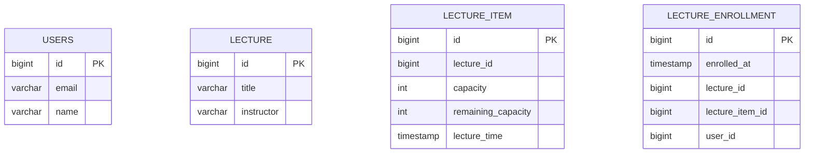

# ERD

---

# 설계 설명

---
1. **다대다 관계 처리**  
   - 강의 항목(`LECTURE_ITEM`)과 사용자(`USERS`) 간의 관계는 다대다 관계입니다. <u>즉, 하나의 강의 항목은 여러 명의 사용자를 가질 수 있고, 한 명의 사용자는 여러 개의 강의 항목에 등록할 수 있습니다.</u>
   - 이를 관리하기 위해 `LECTURE_ENROLLMENT`라는 관계 테이블을 생성했습니다. 이 테이블은 각 사용자가 어떤 강의 항목에 수강 신청을 했는지를 기록하여 관계를 명확히 합니다.

2. **강의 시간 및 수강 인원 관리**  
   - 하나의 강의는 여러 항목을 가질 수 있으며, 각 항목 마다 강의 시간과 수강 인원이 다를 수 있습니다.
   - `LECTURE_ITEM` 테이블을 통해 각 강의의 세부 정보를 관리하고 `LECTURE`를 통해 공통된 강의 정보를 한 번에 변경할 수 있는 유연성을 확보했습니다. 이렇게 하면 강의의 특성을 명확히 유지하면서도 관리가 용이해집니다.

3. **비정규화 및 유니크 키 관리**  
   - `LECTURE_ENROLLMENT` 테이블에 `lecture_id`를 비정규화하여 포함시킨 이유 
     - 한 사용자가 동일한 강의에 대해 한 번만 수강 신청할 수 있도록 유니크 키를 설정할 수 있습니다. 
     - 사용자가 해당 강의에 신청한 이력이 있는지를 빠르게 조회할 수 있어 데이터 접근 속도가 향상됩니다.

4. **테이블 분리를 통한 락 적용 범위 감소**  
   - `LECTURE_ITEM`에만 비관적 락을 적용할 수 있도록 설계하여, 수강 신청 시 필요한 구간에만 락을 걸 수 있도록 하였습니다. 
   - 강의 정보를 변경할 때는 `LECTURE`의 강의 정보에 대한 락이 걸리지 않습니다. 이를 통해 시스템의 성능을 최적화하고, 락으로 인한 병목 현상을 최소화할 수 있습니다.

### 결론
이러한 설계를 통해 확장성, 유연성, 그리고 독립성을 확보할 수 있습니다

- **확장성**: 새로운 강의 항목이나 강의 시간 추가 및 강의 정보 변경 등이 용이하며, 시스템의 확장성이 높아집니다.
- **유연성**: 강의 정보를 쉽게 관리하고 수정할 수 있어, 변화하는 요구에 신속히 대응할 수 있습니다.
- **독립성**: 각 구성 요소가 독립적으로 관리되어, 특정 데이터 변경이 다른 데이터에 미치는 영향을 최소화할 수 있습니다.

이러한 요소들은 시스템이 더 큰 규모로 성장하더라도 안정적으로 운영될 수 있도록 도와줍니다.
